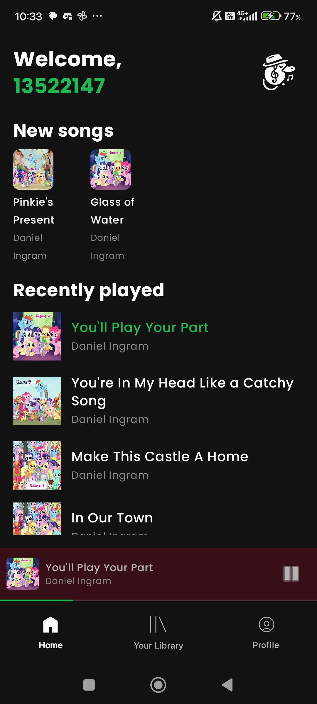
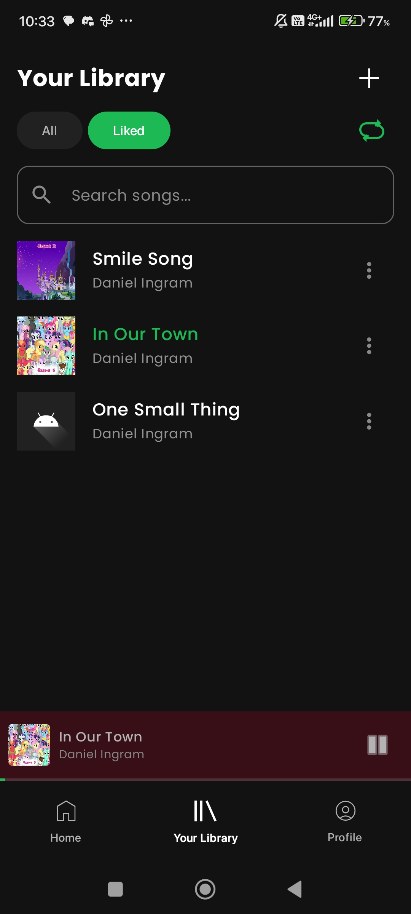
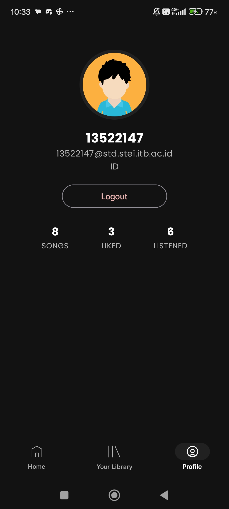

# Tugas Besar 1 - Android IF3210 Pengembangan Aplikasi Piranti Bergerak

## ✨ Daftar Isi

- [Deskripsi Aplikasi Web](#-deskripsi-aplikasi-web)
- [Cara Menjalankan Aplikasi](#-cara-menjalankan-aplikasi)
- [Daftar Library](#-daftar-library)
- [Screenshot Aplikasi](#-screenshot-aplikasi)
- [Pembagian Kerja Kelompok](#-pembagian-kerja-kelompok)
- [Pengerjaan Bonus](#-pengerjaan-bonus)
- [Total Jam Persiapan dan Pengerjaan](#-total-jam-persiapan-dan-pengerjaan)

## ✨ Deskripsi Aplikasi Web

Aplikasi ini adalah Purrytify, yaitu aplikasi pemutar lagu yang diupload oleh pengguna. Aplikasi ini bisa _keep track_ lagu yang diupload oleh pengguna yang berbeda dengan menggunakan email login pengguna. Selain itu juga, pengguna bisa menggunakan fitur pendukung yang biasanya ada di aplikasi pemutar lagu seperti _like_, _queue_, _shuffle_ dan _repeat_.

## ✨ Cara Menjalankan Aplikasi

Install `app.apk`

## ✨ Daftar Library

1. AndroidX Core

   - androidx.core:core-ktx:1.12.0
   - androidx.activity:activity-compose:1.8.2
   - androidx.lifecycle:lifecycle-runtime-ktx:2.7.0

2. Jetpack Compose

   - androidx.compose:compose-bom:2024.02.00
   - androidx.compose.ui:ui
   - androidx.compose.ui:ui-graphics
   - androidx.compose.ui:ui-tooling-preview
   - androidx.compose.material3:material3
   - androidx.compose.material:material-icons-extended:1.5.4
   - androidx.navigation:navigation-compose:2.7.7
   - androidx.lifecycle:lifecycle-viewmodel-compose:2.7.0
   - androidx.lifecycle:lifecycle-runtime-compose:2.7.0

3. Image Loading

   - io.coil-kt:coil-compose:2.2.2

4. Networking

   - com.squareup.retrofit2:retrofit:2.9.0
   - com.squareup.retrofit2:converter-gson:2.9.0
   - com.squareup.okhttp3:logging-interceptor:4.12.0

5. Coroutines

   - org.jetbrains.kotlinx:kotlinx-coroutines-android:1.7.3

6. Security and Crypto

   - androidx.security:security-crypto:1.0.0
   - androidx.localbroadcastmanager:localbroadcastmanager:1.1.0

7. Lifecycle

   - androidx.lifecycle:lifecycle-viewmodel-ktx:2.7.0

8. Database

   - androidx.room:room-runtime:2.6.1
   - androidx.room:room-ktx:2.6.1
   - androidx.room:room-compiler:2.6.1 (kapt)

9. Splash Screen

   - androidx.core:core-splashscreen:1.0.1

## ✨ Screenshot Aplikasi

## ✨ Pembagian Kerja Kelompok

| Fitur              | Kontributor                                                                                                                  |
| ------------------ | ---------------------------------------------------------------------------------------------------------------------------- |
| Setup Projek Awal  | [13522147](https://github.com/Nerggg)                                                                                        |
| Login              | [13522147](https://github.com/Nerggg) [13522161](https://github.com/akmalrmn)                                                |
| Home               | [13522126](https://github.com/rizqikapratamaa) [13522147](https://github.com/Nerggg) [13522161](https://github.com/akmalrmn) |
| Library            | [13522126](https://github.com/rizqikapratamaa) [13522147](https://github.com/Nerggg) [13522161](https://github.com/akmalrmn) |
| Pemutaran Lagu     | [13522126](https://github.com/rizqikapratamaa)                                                                               |
| Penambahan Lagu    | [13522126](https://github.com/rizqikapratamaa) [13522161](https://github.com/akmalrmn)                                       |
| Profile            | [13522147](https://github.com/Nerggg) [13522161](https://github.com/akmalrmn)                                                |
| Liked Songs        | [13522126](https://github.com/rizqikapratamaa)                                                                               |
| Background Service | [13522161](https://github.com/akmalrmn)                                                                                      |
| Network Sensing    | [13522161](https://github.com/akmalrmn)                                                                                      |

## ✨ Pengerjaan Bonus

- Queue: [13522126](https://github.com/rizqikapratamaa)
- Shuffle: [13522126](https://github.com/rizqikapratamaa)
- Repeat: [13522126](https://github.com/rizqikapratamaa)
- [OWASP](OWASP.md): [13522147](https://github.com/Nerggg)
- Pencarian: [13522147](https://github.com/Nerggg)

## ✨ Total Jam Persiapan dan Pengerjaan

| Kontributor                                    | Total Jam |
| ---------------------------------------------- | --------- |
| [13522126](https://github.com/rizqikapratamaa) | 23        |
| [13522147](https://github.com/Nerggg)          | 23        |
| [13522161](https://github.com/akmalrmn)        | 23        |
